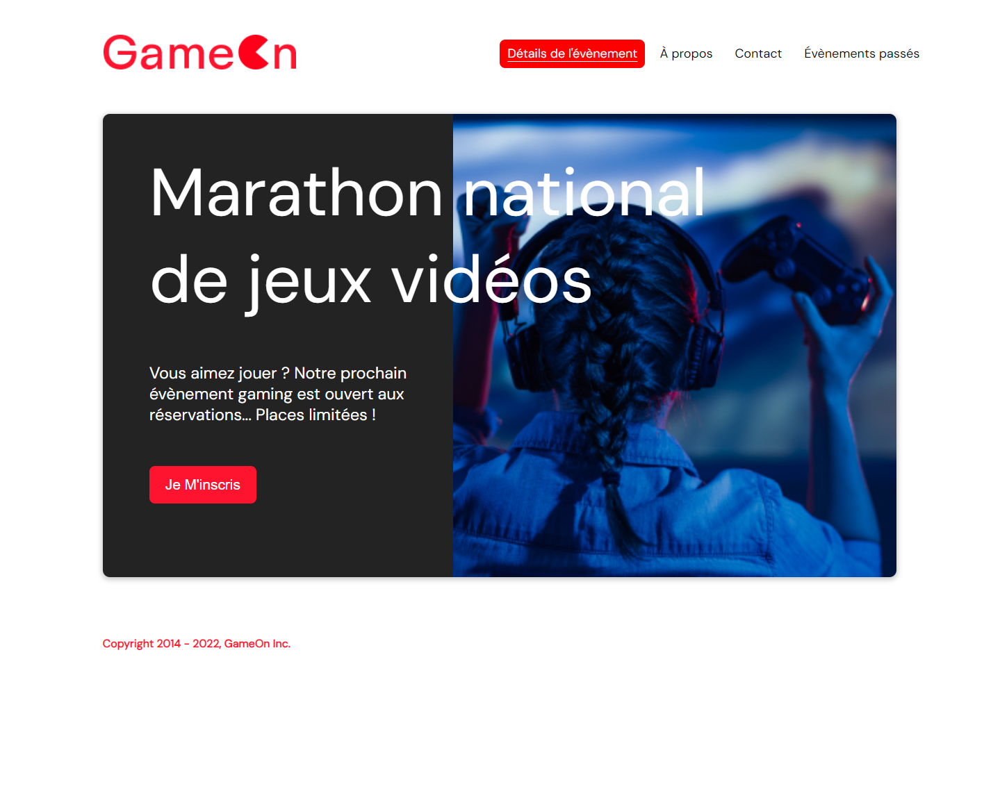
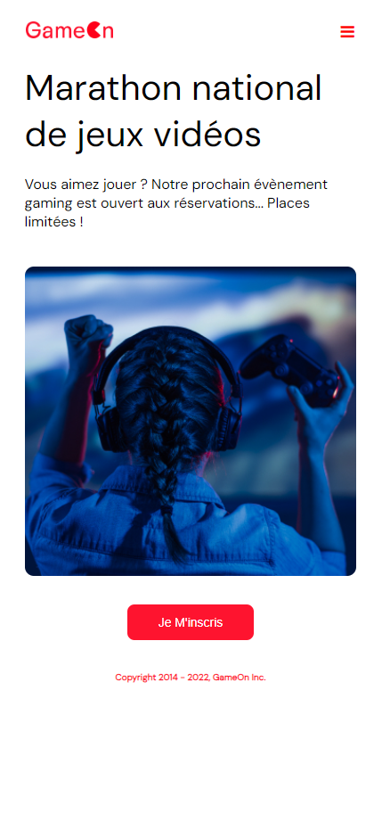
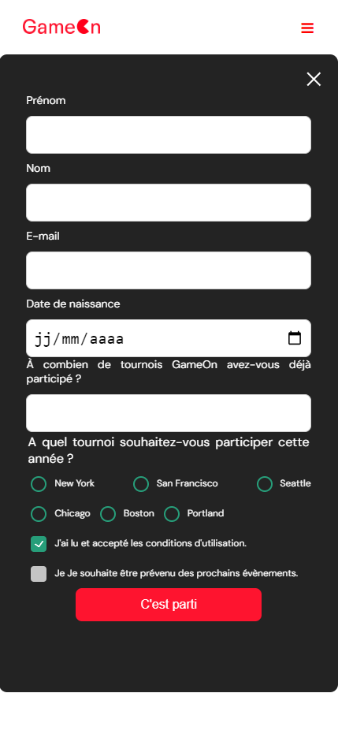

  

##

Récemment été embauché comme développeur Front-End junior dans une PME, GameOn, spécialisée dans les conférences et les concours de jeux, Jason à travaillé sur la nouvelle page d'accueil et l'inscription aux concours après avoir reçu des commentaires négatifs de la part de certains utilisateurs, il n'a pas eu le temps de terminer avant de partir pour son nouveau poste dans sa nouvelle entreprise.

[Lien vers GameOn](https://cyril-vtn.github.io/GameOn-website-FR.github.io/)

## 📝 Table des matières

- [Objectifs](#objectifs)
- [Construit avec](#built_using)
- [Auteur](#auteur)
- [Images](#images)

## 🚀 Objectifs 

Ajouter le code JavaScript manquant pour que le formulaire soit pleinement fonctionnel.

## ⛏️ Construit avec 

HTML
 
CSS
 
JavaScript

## ✍️ Auteur 

[Cyril Votion](https://github.com/Cyril-vtn)

## 📸 Images 

</a>
 
</a>
</a>
